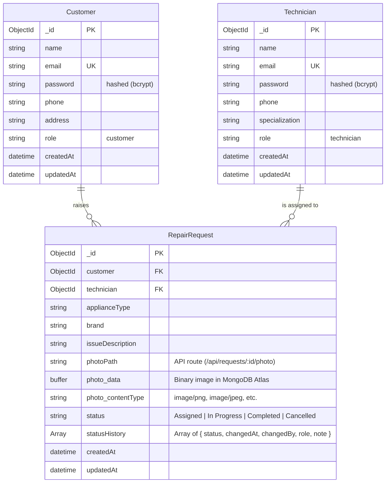
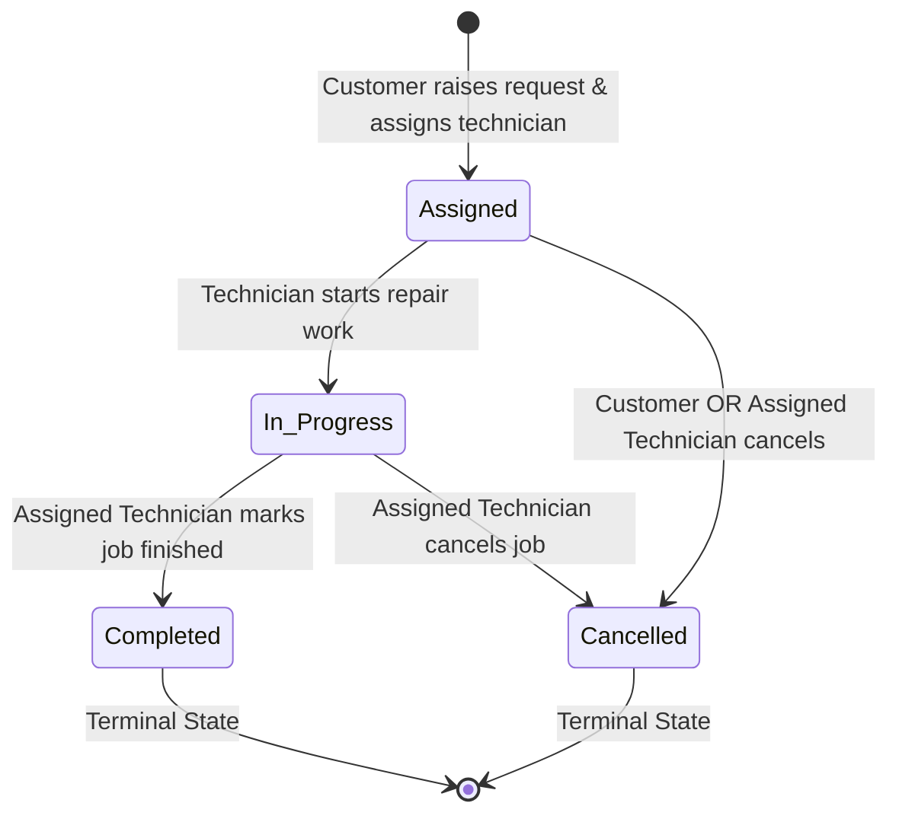

# Repair Service Management System (Case Study #132)

> **B.Tech Computer Science Engineering** — *Backend Development: Node.js, Express.js & MongoDB*  
> **Course Case Study**: Case Study #132 (Page 32 of 50), ITM Skills University, School of FutureTech  
> **Author**: Kartik Wagh

---

## 🌐 Live Production Links & Credentials

- **🚀 Live Frontend Application (Vercel)**:  
  👉 **[https://backend-major-project-dusky.vercel.app/login](https://backend-major-project-dusky.vercel.app/login)**
- **⚡ Live Backend API (Render)**:  
  👉 **[https://backend-major-project-tlhb.onrender.com/api/health](https://backend-major-project-tlhb.onrender.com/api/health)**
- **📦 GitHub Repository**:  
  👉 **[https://github.com/kartikwagh21/Backend_Major_Project](https://github.com/kartikwagh21/Backend_Major_Project)**
- **📑 Postman Collection**: Located in `postman/Repair_Service_API.postman_collection.json`

### 🔑 Demo Credentials:
| Role | Email | Password | Location / Specialization |
| :--- | :--- | :--- | :--- |
| **Customer** | `kartik.wagh@gmail.com` | `password123` | Vashi, Navi Mumbai |
| **Technician** | `rajesh.sharma@fixitpro.in` | `password123` | Air Conditioner (AC) |

*(Use the **Fill Demo Customer** or **Fill Demo Technician** buttons on the login screen for instant 1-click access).*

---

## 1. Project Overview

The **Repair Service Management System** (**FixIt Pro**) is a full-stack, enterprise-grade web application built to streamline appliance repair requests between customers and certified technicians. 

### Key Features:
- **Customer Portal**: Customers can raise repair requests with photo upload (handled in-memory via Multer and stored directly in MongoDB Atlas as Binary Buffers) and track status in real-time.
- **Customer Cancellation**: Customers can cancel their own repair requests while in `Assigned` status via `PATCH /api/requests/:id/status`.
- **Technician Workspace**: Technicians can view jobs assigned to them and update workflow stages (`Assigned` &rarr; `In Progress` &rarr; `Completed`).
- **Secure Image Streaming**: Appliance photos are stored in MongoDB Atlas and served via the authenticated endpoint `GET /api/requests/:id/photo` with strict ownership checks (only the owner customer or assigned technician can view the photo).
- **Role-Based & Ownership-Based Authorization**:
  - Customers can only view and access their own requests.
  - Technicians can only view and update requests assigned directly to them.
  - `GET /api/technicians` is restricted to customers and exposes non-sensitive fields (`name`, `specialization`, `_id`).
  - Unauthorized access attempts are strictly rejected with HTTP `403 Forbidden`.
- **Strict Status State Machine**: Enforces valid progression order and records an immutable audit log (`statusHistory`) with timestamps, roles, and user details.
- **Robust Validation**: Server-side request validation using `express-validator` ensuring data integrity and role safety.

---

## 2. Tech Stack

| Domain | Technology | Purpose |
|---|---|---|
| **Runtime** | Node.js | Asynchronous JavaScript runtime |
| **Framework** | Express.js | High-performance RESTful API framework |
| **Database** | MongoDB Atlas / MongoDB | Document-oriented NoSQL database |
| **ODM** | Mongoose | Schema modeling, validation, and population |
| **Authentication** | JSON Web Tokens (`jsonwebtoken`) + `bcryptjs` | Stateless authentication and password hashing |
| **File Storage** | Multer (`memoryStorage`) & MongoDB Atlas Buffer | Cloud-resilient binary storage without ephemeral-disk data loss |
| **Validation** | `express-validator` | Structured request body & param validation |
| **Testing** | Jest + Supertest + `mongodb-memory-server` | Comprehensive automated unit and integration test suite |
| **Frontend** | React 18 + Vite | Lightning-fast Single Page Application (SPA) |
| **Routing** | React Router v6 | Client-side routing with role-based guards |
| **HTTP Client** | Axios | API consumption with JWT request interceptors & secure blob image handling |
| **Design** | Vanilla CSS (Glassmorphism design system) | Modern, responsive dark styling |

---

## 3. Directory Structure

```
Kartik_Wagh/
├── sample_appliance_images/           # High-resolution PNG appliance photos for upload and seeding
│   ├── voltas_1.5ton_split_ac.png
│   ├── daikin_2ton_inverter_ac.png
│   ├── panasonic_1ton_smart_ac.png
│   ├── lg_8kg_frontload_washing_machine.png
│   ├── bosch_serie6_washing_machine.png
│   ├── samsung_345L_frost_free_fridge.png
│   ├── whirlpool_300L_protton_fridge.png
│   ├── ifb_30L_convection_microwave.png
│   ├── sony_bravia_55inch_4k_tv.png
│   └── kent_grand_plus_ro_purifier.png
├── backend/
│   ├── config/
│   │   ├── db.js                      # MongoDB Atlas connection & empty DB auto-seeder
│   │   ├── seed.js                    # Minimal demo seeder
│   │   ├── seedRealisticData.js       # Indian Mumbai dataset seeder with binary PNG photos
│   │   └── seedRunner.js              # Standalone manual seed CLI runner (npm run seed)
│   ├── controllers/
│   │   ├── authController.js          # Register, Login, Me endpoints
│   │   ├── requestController.js       # Repair request CRUD, photo stream & workflow logic
│   │   └── technicianController.js    # Technician directory endpoint (non-sensitive fields)
│   ├── middleware/
│   │   ├── authMiddleware.js          # JWT verification & user attachment
│   │   ├── roleMiddleware.js          # Role-based guard (customer / technician)
│   │   ├── ownershipMiddleware.js     # Ownership & technician assignment guard
│   │   ├── uploadMiddleware.js        # Multer memoryStorage & MIME filter
│   │   ├── validateMiddleware.js      # Express-validator rules & error formatter
│   │   └── errorMiddleware.js         # Centralized error & 404 handler
│   ├── models/
│   │   ├── Customer.js                # Customer Mongoose model
│   │   ├── Technician.js              # Technician Mongoose model
│   │   └── RepairRequest.js           # RepairRequest schema with binary photo and audit trail
│   ├── routes/
│   │   ├── authRoutes.js              # /api/auth
│   │   ├── requestRoutes.js           # /api/requests (CRUD, photo, status)
│   │   └── technicianRoutes.js        # /api/technicians
│   ├── tests/
│   │   └── api.test.js                # Comprehensive Jest test suite
│   ├── test-runner.js                 # Standalone integration test runner
│   ├── .env.example                   # Backend environment template
│   ├── .gitignore
│   ├── package.json
│   └── server.js                      # Main Express server entry point
├── frontend/                          # React (Vite) Single Page App
│   ├── public/
│   │   └── _redirects                 # SPA redirects for static hosts
│   ├── src/
│   │   ├── api/
│   │   │   └── axios.js               # Configured Axios instance with JWT interceptor
│   │   ├── components/
│   │   │   ├── Navbar.jsx             # Top bar navigation & user indicator
│   │   │   ├── PhotoModal.jsx         # Full-screen appliance photo lightbox
│   │   │   ├── ProtectedRoute.jsx     # Route authentication & role guard
│   │   │   ├── SecureImage.jsx        # Authenticated photo stream component with Object URL lifecycle
│   │   │   ├── StatusBadge.jsx        # Color-coded workflow badge
│   │   │   └── StatusHistoryTimeline.jsx # Visual audit trail timeline
│   │   ├── context/
│   │   │   └── AuthContext.jsx        # Global auth state & persistent token
│   │   ├── pages/
│   │   │   ├── CustomerDashboard.jsx  # Customer request tracker with cancel action
│   │   │   ├── Login.jsx              # Sign-in page with quick demo accounts
│   │   │   ├── RaiseRequest.jsx       # Request form with Multer image upload
│   │   │   ├── Register.jsx           # Account creation with role selection
│   │   │   ├── RequestDetails.jsx     # Detailed view, photo, timeline & status controls
│   │   │   └── TechnicianDashboard.jsx# Technician task workspace
│   │   ├── App.jsx                    # Root routing configuration
│   │   ├── index.css                  # Custom design system tokens
│   │   └── main.jsx
│   ├── .env.example
│   ├── .gitignore
│   ├── package.json
│   ├── vercel.json                    # Vercel SPA rewrite config
│   └── vite.config.js
├── postman/
│   └── Repair_Service_API.postman_collection.json # Complete API collection with tests
└── README.md
```

---

## 4. Database Schema & Data Models



---

## 5. Status Workflow State Machine

The status transitions are strictly enforced on the backend by `requestController.js`:



### Transition Rules:
1. **Customer Cancellation**: The owner customer can set status to `Cancelled` **only** while the current status is `Assigned`. Attempts to cancel from other stages or update to other statuses return HTTP `400 Bad Request`.
2. **Technician Workflow**: The assigned technician can progress `Assigned` &rarr; `In Progress` &rarr; `Completed`, or `Cancelled`.
3. **Immutability**: Terminal states (`Completed`, `Cancelled`) cannot be transitioned further.
4. **Audit Trail**: Every change appends an immutable entry to `statusHistory` recording updater name, role, timestamp, and notes.

---

## 6. REST API Endpoints

Base URL: `http://localhost:5000/api`

### 6.1 Authentication (`/api/auth`)

| Method | Endpoint | Access | Description |
|---|---|---|---|
| `POST` | `/auth/register` | Public | Register customer or technician account (`role` strictly `'customer'` or `'technician'`) |
| `POST` | `/auth/login` | Public | Login with email & password, returns JWT |
| `GET` | `/auth/me` | Authenticated | Get current logged-in user profile |

### 6.2 Technicians (`/api/technicians`)

| Method | Endpoint | Access | Description |
|---|---|---|---|
| `GET` | `/technicians` | Customer only | List all technicians with non-sensitive fields (`name`, `specialization`, `_id`) |

### 6.3 Repair Requests (`/api/requests`)

| Method | Endpoint | Access | Description |
|---|---|---|---|
| `POST` | `/requests` | Customer only | Raise a repair request with appliance photo (`multipart/form-data`, stored in MongoDB) |
| `GET` | `/requests/my` | Customer only | Get all requests raised by the logged-in customer |
| `GET` | `/requests/assigned` | Technician only | Get all requests assigned to the logged-in technician |
| `GET` | `/requests/:id` | Owner Customer or Assigned Technician | Get full request details, populated customer/technician, and audit timeline |
| `GET` | `/requests/:id/photo` | Owner Customer or Assigned Technician | Stream appliance photo securely from MongoDB Atlas with correct `Content-Type` |
| `PATCH` | `/requests/:id/status` | Assigned Technician or Owner Customer | Technician updates stage (`In Progress`, `Completed`, `Cancelled`); Customer cancels while `Assigned` |

---

## 7. Sample API Payloads

### 7.1 Register Customer
```http
POST /api/auth/register
Content-Type: application/json

{
  "name": "Alice Customer",
  "email": "alice@example.com",
  "password": "password123",
  "phone": "+1-555-0144",
  "address": "742 Evergreen Terrace",
  "role": "customer"
}
```

### 7.2 Register Technician
```http
POST /api/auth/register
Content-Type: application/json

{
  "name": "Bob Tech",
  "email": "bob@example.com",
  "password": "password123",
  "phone": "+1-555-0188",
  "specialization": "Air Conditioner (AC)",
  "role": "technician"
}
```

### 7.3 Create Repair Request (with Multer Photo Upload to MongoDB)
```http
POST /api/requests
Authorization: Bearer <customer_jwt_token>
Content-Type: multipart/form-data

technician: 6659f81a7d18e9a2c34d5678
applianceType: Air Conditioner (AC)
brand: Daikin Inverter
issueDescription: Indoor unit showing error code E4 and not cooling.
photo: [Binary Image File] (image/jpeg, image/png, image/webp)
```

**Success Response (HTTP 201):**
```json
{
  "success": true,
  "message": "Repair request raised and assigned successfully.",
  "data": {
    "_id": "6659f93c7d18e9a2c34d5690",
    "customer": {
      "_id": "6659f80a7d18e9a2c34d5670",
      "name": "Alice Customer",
      "email": "alice@example.com",
      "phone": "+1-555-0144"
    },
    "technician": {
      "_id": "6659f81a7d18e9a2c34d5678",
      "name": "Bob Tech",
      "specialization": "Air Conditioner (AC)"
    },
    "applianceType": "Air Conditioner (AC)",
    "brand": "Daikin Inverter",
    "issueDescription": "Indoor unit showing error code E4 and not cooling.",
    "photoPath": "/api/requests/6659f93c7d18e9a2c34d5690/photo",
    "status": "Assigned",
    "statusHistory": [
      {
        "status": "Assigned",
        "changedAt": "2026-09-30T18:00:00.000Z",
        "changedBy": "Alice Customer (Customer)",
        "role": "customer",
        "note": "Repair request raised and assigned to technician Bob Tech."
      }
    ],
    "createdAt": "2026-09-30T18:00:00.000Z"
  }
}
```

### 7.4 Customer Cancel Request
```http
PATCH /api/requests/6659f93c7d18e9a2c34d5690/status
Authorization: Bearer <customer_jwt_token>
Content-Type: application/json

{
  "status": "Cancelled",
  "note": "Issue resolved on its own."
}
```

### 7.5 Technician Update Status
```http
PATCH /api/requests/6659f93c7d18e9a2c34d5690/status
Authorization: Bearer <technician_jwt_token>
Content-Type: application/json

{
  "status": "In Progress",
  "note": "Replaced starting capacitor and topped up R32 gas."
}
```

---

## 8. Installation & Local Setup

### Prerequisites:
- **Node.js**: v18+ or v20+
- **npm**: v9+
- **MongoDB**: Local MongoDB instance (`mongodb://127.0.0.1:27017`) or MongoDB Atlas URI.

---

### Step 1: Clone or Navigate to the Project
```bash
git clone https://github.com/kartikwagh21/Backend_Major_Project.git
cd Backend_Major_Project/Kartik_Wagh
```

---

### Step 2: Backend Setup
1. Navigate to `backend`:
   ```bash
   cd backend
   ```
2. Install dependencies:
   ```bash
   npm install
   ```
3. Create `.env` from `.env.example`:
   ```bash
   cp .env.example .env
   ```
4. Set your configuration in `backend/.env`:
   ```env
   PORT=5000
   MONGO_URI=mongodb+srv://<username>:<password>@cluster.mongodb.net/repair_service?retryWrites=true&w=majority
   JWT_SECRET=<generate_a_long_random_string>
   JWT_EXPIRES_IN=7d
   MAX_FILE_SIZE_MB=5
   CLIENT_URL=http://localhost:5173
   ```
5. *(Optional)* Seed demo data manually:
   ```bash
   npm run seed
   ```
   > **Note**: On server startup, the backend checks if the database is empty (`Customer.countDocuments() === 0`) and automatically seeds realistic demo data only if no customer records exist. It never wipes existing data on server restarts.

6. Start the backend server:
   ```bash
   # Development mode with nodemon auto-restart:
   npm run dev

   # Production mode:
   npm start
   ```
   *Backend will run on `http://localhost:5000`.*

---

### Step 3: Frontend Setup
1. Open a new terminal and navigate to `frontend`:
   ```bash
   cd frontend
   ```
2. Install dependencies:
   ```bash
   npm install
   ```
3. Create `.env` from `.env.example`:
   ```bash
   cp .env.example .env
   ```
   Content of `frontend/.env`:
   ```env
   VITE_API_BASE_URL=http://localhost:5000/api
   ```
4. Start the frontend Vite development server:
   ```bash
   npm run dev
   ```
   *Frontend will run on `http://localhost:5173`.*

---

## 9. Running Automated Tests

A complete automated Jest + Supertest test suite with an in-memory MongoDB engine is included:

```bash
cd backend
npm test
```

### Verified Test Cases:
- [x] Customer & Technician registration with bcrypt hashing and JWT generation.
- [x] Reject invalid role registration with `400 Bad Request`.
- [x] Authenticated `/me` user profile endpoint.
- [x] Customer access to `/api/technicians` returning only non-sensitive fields (`name`, `specialization`, `_id`).
- [x] Technician access to `/api/technicians` rejected with `403 Forbidden`.
- [x] Multer memory storage photo upload saving Buffer directly in MongoDB.
- [x] Missing appliance photo rejected with `400 Bad Request`.
- [x] Customer receives only their own requests (`GET /api/requests/my`).
- [x] Technician receives only assigned requests (`GET /api/requests/assigned`).
- [x] Owner customer and assigned technician can stream photo via `GET /api/requests/:id/photo`.
- [x] Stranger customer or technician viewing photo rejected with `403 Forbidden`.
- [x] Stranger customer viewing request details rejected with `403 Forbidden`.
- [x] Owner customer can cancel request while status is `Assigned`.
- [x] Customer cancellation rejected with `400` if status has progressed to `In Progress`.
- [x] Assigned technician updates status through valid transitions (`Assigned` &rarr; `In Progress` &rarr; `Completed`).
- [x] Unassigned technician status updates rejected with `403 Forbidden`.
- [x] Invalid status transitions and updates to terminal states rejected with `400 Bad Request`.

---

## 10. Postman Collection Usage

1. Open **Postman** (or Thunder Client in VS Code).
2. Click **Import** &rarr; select `postman/Repair_Service_API.postman_collection.json`.
3. The collection is pre-configured with automatic environment variables:
   - When you execute **Login Customer**, the `customerToken` is automatically captured.
   - When you execute **Login Technician**, the `technicianToken` is automatically captured.
   - When you create a request, the `requestId` is automatically updated for subsequent photo, status, and cancellation test calls.

---

## 11. Deployment Guide

### 11.1 Backend Deployment (Render)
1. Push the code to GitHub.
2. In **Render**, create a new **Web Service** pointing to the repository with Root Directory `Kartik_Wagh/backend`.
3. Configure build & start commands:
   - **Build Command**: `npm install`
   - **Start Command**: `node server.js`
4. Configure Environment Variables in Render Dashboard:
   - `PORT`: `5000` (or leave default assigned by Render)
   - `MONGO_URI`: `mongodb+srv://<user>:<password>@cluster.mongodb.net/repair_service`
   - `JWT_SECRET`: `<generate_a_long_random_string>`
   - `JWT_EXPIRES_IN`: `7d`
   - `MAX_FILE_SIZE_MB`: `5`
   - `CLIENT_URL`: `https://backend-major-project-dusky.vercel.app`
5. *Image Storage*: Uploaded photos are stored directly in MongoDB Atlas as binary buffers and streamed via `/api/requests/:id/photo`. There is no ephemeral-disk data loss across server restarts or redeployments.

### 11.2 Frontend Deployment (Vercel)
1. In **Vercel**, create a new project and set the Root Directory to `Kartik_Wagh/frontend`.
2. Configure build settings:
   - **Build Command**: `npm run build`
   - **Output Directory**: `dist`
3. Add Environment Variable:
   - `VITE_API_BASE_URL`: `https://backend-major-project-tlhb.onrender.com/api`
4. The included `vercel.json` ensures SPA client-side routing works seamlessly across all page refreshes.

---

## 12. Case Study Compliance Checklist

- [x] **Customer Schema**: `name`, `email` (unique), `password` (hashed with bcrypt, `select: false`), `phone`, `address`, `role: 'customer'`, timestamps.
- [x] **Technician Schema**: `name`, `email` (unique), `password` (hashed, `select: false`), `phone`, `specialization`, `role: 'technician'`, timestamps.
- [x] **RepairRequest Schema**: `customer` (ref `Customer`), `technician` (ref `Technician`), `applianceType`, `brand`, `issueDescription` (min 10 chars), `photoPath` (`/api/requests/:id/photo`), `photo.data` (Buffer), `photo.contentType`, `status` (enum), `statusHistory` audit array, timestamps.
- [x] **Multer Upload**: Configured with `memoryStorage`, 5MB size limit, JPEG/PNG/WebP filter, stored in MongoDB Atlas as Binary Buffers, and streamed through authenticated endpoint `GET /api/requests/:id/photo`.
- [x] **Authorization**: JWT authentication middleware, role-based checks (`authorizeRoles`), and ownership/assignment checks (`checkRequestAccess`).
- [x] **Status Workflow & Customer Cancel**: State machine enforcement (`Assigned` &rarr; `In Progress` &rarr; `Completed`) with Customer Cancellation allowed from `Assigned` state and immutable history recording.
- [x] **React Frontend**: Full UI with login/register role toggle, Customer Dashboard with photo thumbnails, metrics, and cancel action, Technician Workspace with workflow buttons, Raise Request form with photo preview, and Request Details page with audit timeline and secure photo lightbox.
- [x] **Postman Collection & Documentation**: Complete Postman collection with test scripts and comprehensive README.
