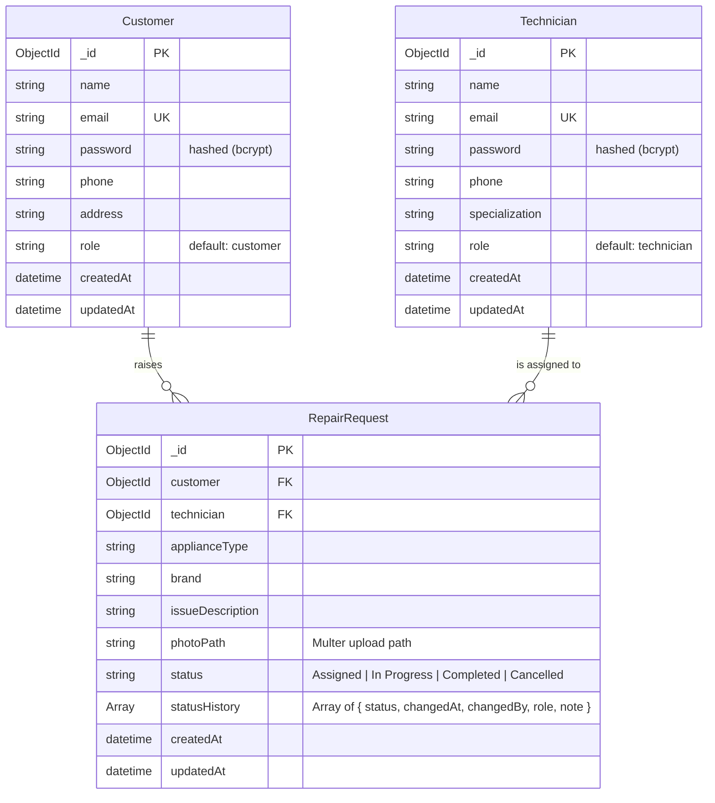
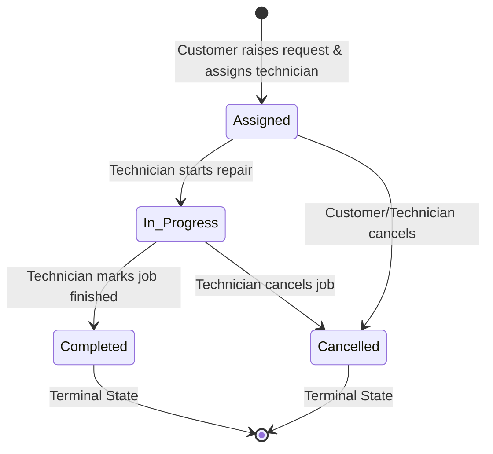

# Repair Service Management System (Case Study #132)

> **B.Tech Computer Science Engineering** — *Backend Development: Node.js, Express.js & MongoDB*  
> **Course Case Study**: Case Study #132 (Page 32 of 50), ITM Skills University, School of FutureTech  
> **Author**: Kartik Wagh

---

## 1. Project Overview

The **Repair Service Management System** (**FixIt Pro**) is a full-stack, enterprise-grade web application built to streamline appliance repair requests between customers and certified technicians. 

### Key Features:
- **Customer Portal**: Customers can raise repair requests with photo upload (handled via Multer) and track status in real-time.
- **Technician Workspace**: Technicians can view jobs assigned to them and update workflow stages (`Assigned` &rarr; `In Progress` &rarr; `Completed`).
- **Role-Based & Ownership-Based Authorization**:
  - Customers can only view and access their own requests.
  - Technicians can only view and update requests assigned directly to them.
  - Unauthorized access attempts are strictly rejected with HTTP `403 Forbidden`.
- **Strict Status State Machine**: Enforces valid progression order and records an immutable audit log (`statusHistory`) with timestamps and user details.
- **Robust Validation**: Server-side request validation using `express-validator` with automatic cleanup of uploaded files if validation fails.

---

## 2. Tech Stack

| Domain | Technology | Purpose |
|---|---|---|
| **Runtime** | Node.js | Asynchronous JavaScript runtime |
| **Framework** | Express.js | High-performance RESTful API framework |
| **Database** | MongoDB Atlas / MongoDB | Document-oriented NoSQL database |
| **ODM** | Mongoose | Schema modeling, validation, and population |
| **Authentication** | JSON Web Tokens (`jsonwebtoken`) + `bcryptjs` | Stateless authentication and password hashing |
| **File Storage** | Multer | Multi-part form-data handling for appliance photos |
| **Validation** | `express-validator` | Structured request body & param validation |
| **Frontend** | React 18 + Vite | Lightning-fast Single Page Application (SPA) |
| **Routing** | React Router v6 | Client-side routing with role-based guards |
| **HTTP Client** | Axios | API consumption with JWT request interceptors |
| **Design** | Vanilla CSS (Glassmorphism design system) | Modern, responsive dark/light styling |

---

## 3. Directory Structure

```
Kartik_Wagh/
├── sample_appliance_images/           # High-resolution appliance photos for upload testing
│   ├── voltas_1.5ton_split_ac.svg
│   ├── daikin_2ton_inverter_ac.svg
│   ├── panasonic_1ton_smart_ac.svg
│   ├── lg_8kg_frontload_washing_machine.svg
│   ├── bosch_serie6_washing_machine.svg
│   ├── samsung_345L_frost_free_fridge.svg
│   ├── whirlpool_300L_protton_fridge.svg
│   ├── ifb_30L_convection_microwave.svg
│   ├── sony_bravia_55inch_4k_tv.svg
│   └── kent_grand_plus_ro_purifier.svg
├── backend/
│   ├── config/
│   │   ├── db.js                      # MongoDB Atlas / Memory fallback connection
│   │   └── seedRealisticData.js       # Indian Mumbai dataset seeder
│   ├── controllers/
│   │   ├── authController.js          # Register, Login, Me endpoints
│   │   ├── requestController.js       # Repair request CRUD & workflow logic
│   │   └── technicianController.js    # Technician directory endpoints
│   ├── middleware/
│   │   ├── authMiddleware.js          # JWT verification & user attachment
│   │   ├── roleMiddleware.js          # Role-based guard (customer / technician)
│   │   ├── ownershipMiddleware.js     # Ownership & technician assignment guard
│   │   ├── uploadMiddleware.js        # Multer diskStorage, filter & file cleanup
│   │   ├── validateMiddleware.js      # Express-validator rules & error formatter
│   │   └── errorMiddleware.js         # Centralized error & 404 handler
│   ├── models/
│   │   ├── Customer.js                # Customer Mongoose model
│   │   ├── Technician.js              # Technician Mongoose model
│   │   └── RepairRequest.js           # RepairRequest schema with referenced IDs
│   ├── routes/
│   │   ├── authRoutes.js              # /api/auth
│   │   ├── requestRoutes.js           # /api/requests
│   │   └── technicianRoutes.js        # /api/technicians
│   ├── uploads/                       # Appliance image uploads (.gitkeep)
│   ├── .env.example                   # Backend environment template
│   ├── .gitignore
│   ├── package.json
│   └── server.js                      # Main Express server entry point
├── frontend/                          # React (Vite) Single Page App
│   ├── public/
│   │   └── _redirects                 # Netlify SPA redirect
│   ├── src/
│   │   ├── api/
│   │   │   └── axios.js               # Configured Axios instance with JWT interceptor
│   │   ├── components/
│   │   │   ├── Navbar.jsx             # Top bar navigation & user indicator
│   │   │   ├── PhotoModal.jsx         # Full-screen appliance photo lightbox
│   │   │   ├── ProtectedRoute.jsx     # Route authentication & role guard
│   │   │   ├── StatusBadge.jsx        # Color-coded workflow badge
│   │   │   └── StatusHistoryTimeline.jsx # Visual audit trail timeline
│   │   ├── context/
│   │   │   └── AuthContext.jsx        # Global auth state & persistent token
│   │   ├── pages/
│   │   │   ├── CustomerDashboard.jsx  # Customer request tracker
│   │   │   ├── Login.jsx              # Sign-in page with quick demo accounts
│   │   │   ├── RaiseRequest.jsx       # Request form with Multer image upload
│   │   │   ├── Register.jsx           # Account creation with role selection
│   │   │   ├── RequestDetails.jsx     # Detailed view & technician workflow controls
│   │   │   └── TechnicianDashboard.jsx# Technician task workspace
│   │   ├── App.jsx                    # Root routing configuration
│   │   ├── index.css                  # Custom design system tokens
│   │   └── main.jsx
│   ├── .env.example
│   ├── package.json
│   ├── vercel.json                    # Vercel SPA rewrite config
│   └── vite.config.js
├── postman/
│   └── Repair_Service_API.postman_collection.json # Complete API collection
└── README.md
```

---

## 4. Database Schema & Data Models



---

## 5. Status Workflow State Machine

The status transitions are enforced on the backend by `requestController.js`:



- Any attempt by a technician to skip stages (e.g., `Assigned` &rarr; `Completed`) or update finished requests is rejected with HTTP `400 Bad Request`.
- Every transition appends a record to `statusHistory` with the updater's name, role, timestamp, and optional remarks.

---

## 6. REST API Endpoints

Base URL: `http://localhost:5000/api`

### 6.1 Authentication (`/api/auth`)

| Method | Endpoint | Access | Description |
|---|---|---|---|
| `POST` | `/auth/register` | Public | Register customer or technician account |
| `POST` | `/auth/login` | Public | Login with email & password, returns JWT |
| `GET` | `/auth/me` | Authenticated | Get current logged-in user profile |

### 6.2 Technicians (`/api/technicians`)

| Method | Endpoint | Access | Description |
|---|---|---|---|
| `GET` | `/technicians` | Authenticated | List all registered technicians for assignment |

### 6.3 Repair Requests (`/api/requests`)

| Method | Endpoint | Access | Description |
|---|---|---|---|
| `POST` | `/requests` | Customer only | Raise a repair request with appliance photo (`multipart/form-data`) |
| `GET` | `/requests/my` | Customer only | Get all requests raised by the logged-in customer |
| `GET` | `/requests/assigned` | Technician only | Get all requests assigned to the logged-in technician |
| `GET` | `/requests/:id` | Owner Customer or Assigned Technician | Get full request details, photo, and audit timeline |
| `PATCH` | `/requests/:id/status` | Assigned Technician only | Update request status (`Assigned` &rarr; `In Progress` &rarr; `Completed`) |

### 6.4 Static Uploads

| Method | Endpoint | Access | Description |
|---|---|---|---|
| `GET` | `/uploads/:filename` | Public | Serve uploaded appliance photos |

---

## 7. Sample API Payloads

### 7.1 Register Customer
```http
POST /api/auth/register
Content-Type: application/json

{
  "name": "Alice Customer",
  "email": "alice@example.com",
  "password": "password123",
  "phone": "+1-555-0144",
  "address": "742 Evergreen Terrace",
  "role": "customer"
}
```

### 7.2 Register Technician
```http
POST /api/auth/register
Content-Type: application/json

{
  "name": "Bob Tech",
  "email": "bob@example.com",
  "password": "password123",
  "phone": "+1-555-0188",
  "specialization": "Air Conditioner (AC)",
  "role": "technician"
}
```

### 7.3 Create Repair Request (with Multer Photo Upload)
```http
POST /api/requests
Authorization: Bearer <customer_jwt_token>
Content-Type: multipart/form-data

technician: 6659f81a7d18e9a2c34d5678
applianceType: Air Conditioner (AC)
brand: Daikin Inverter
issueDescription: Indoor unit showing error code E4 and not cooling.
photo: [Binary Image File] (image/jpeg, image/png, image/webp)
```

**Success Response (HTTP 201):**
```json
{
  "success": true,
  "message": "Repair request raised and assigned successfully.",
  "data": {
    "_id": "6659f93c7d18e9a2c34d5690",
    "customer": {
      "_id": "6659f80a7d18e9a2c34d5670",
      "name": "Alice Customer",
      "email": "alice@example.com",
      "phone": "+1-555-0144"
    },
    "technician": {
      "_id": "6659f81a7d18e9a2c34d5678",
      "name": "Bob Tech",
      "specialization": "Air Conditioner (AC)"
    },
    "applianceType": "Air Conditioner (AC)",
    "brand": "Daikin Inverter",
    "issueDescription": "Indoor unit showing error code E4 and not cooling.",
    "photoPath": "uploads/appliance-1717171234567-987654321.jpg",
    "status": "Assigned",
    "statusHistory": [
      {
        "status": "Assigned",
        "changedAt": "2026-09-29T18:00:00.000Z",
        "changedBy": "Alice Customer (Customer)",
        "role": "customer",
        "note": "Repair request raised and assigned to technician Bob Tech."
      }
    ],
    "createdAt": "2026-09-29T18:00:00.000Z"
  }
}
```

### 7.4 Update Status by Assigned Technician
```http
PATCH /api/requests/6659f93c7d18e9a2c34d5690/status
Authorization: Bearer <technician_jwt_token>
Content-Type: application/json

{
  "status": "In Progress",
  "note": "Replaced starting capacitor and topped up R32 gas."
}
```

---

## 8. Installation & Local Setup

### Prerequisites:
- **Node.js**: v18+ or v20+
- **npm**: v9+
- **MongoDB**: Local MongoDB instance (`mongodb://127.0.0.1:27017`) or free MongoDB Atlas cloud cluster URI.

---

### Step 1: Clone or Navigate to the Project
```bash
cd "Downloads/Backend Major Project/Kartik_Wagh"
```

---

### Step 2: Backend Setup
1. Navigate to the backend directory:
   ```bash
   cd backend
   ```
2. Install dependencies:
   ```bash
   npm install
   ```
3. Create `.env` from `.env.example`:
   ```bash
   cp .env.example .env
   ```
4. Set your MongoDB connection string in `backend/.env`:
   ```env
   PORT=5000
   MONGO_URI=mongodb+srv://<username>:<password>@cluster.mongodb.net/repair_service?retryWrites=true&w=majority
   JWT_SECRET=repair_service_super_secret_jwt_key_2026_case_study_132
   JWT_EXPIRES_IN=7d
   UPLOAD_PATH=uploads
   MAX_FILE_SIZE_MB=5
   CLIENT_URL=http://localhost:5173
   ```
5. Start the backend server:
   ```bash
   # Development mode with nodemon auto-restart:
   npm run dev

   # Production mode:
   npm start
   ```
   *Backend will run on `http://localhost:5000`.*

---

### Step 3: Frontend Setup
1. Open a new terminal and navigate to `frontend`:
   ```bash
   cd "Downloads/Backend Major Project/Kartik_Wagh/frontend"
   ```
2. Install dependencies:
   ```bash
   npm install
   ```
3. Create `.env` from `.env.example`:
   ```bash
   cp .env.example .env
   ```
   Content of `frontend/.env`:
   ```env
   VITE_API_BASE_URL=http://localhost:5000/api
   VITE_IMAGE_BASE_URL=http://localhost:5000/
   ```
4. Start the frontend Vite development server:
   ```bash
   npm run dev
   ```
   *Frontend will run on `http://localhost:5173`.*

---

## 9. Running Automated Tests

A complete automated end-to-end integration test suite is included to verify all positive and negative test cases against an in-memory MongoDB engine:

```bash
cd backend
npm test
```

This verifies:
- [x] Customer & Technician registration and login with bcrypt & JWT.
- [x] Multer photo upload and valid `photoPath` storage.
- [x] Referenced Mongoose population between `Customer`, `Technician`, and `RepairRequest`.
- [x] Customer receives only their own requests (`GET /api/requests/my`).
- [x] Technician receives only assigned requests (`GET /api/requests/assigned`).
- [x] Assigned technician updates status through valid transitions (`Assigned` &rarr; `In Progress` &rarr; `Completed`).
- [x] **403 Forbidden** returned when an unassigned technician attempts to update another technician's request.
- [x] **403 Forbidden** returned when a customer attempts to view another customer's request.
- [x] **400 Bad Request** returned when attempting invalid status transitions or omitting the appliance photo.

---

## 10. Postman Collection Usage

1. Open **Postman** (or Thunder Client in VS Code).
2. Click **Import** &rarr; select `postman/Repair_Service_API.postman_collection.json`.
3. The collection is pre-configured with automatic environment variables:
   - When you execute **Login Customer**, the `customerToken` is automatically captured.
   - When you execute **Login Technician**, the `technicianToken` is automatically captured.
   - When you create a request, the `requestId` is automatically updated for subsequent test calls.

---

## 11. Deployment Guide

### 11.1 Backend Deployment (Render / Railway)
1. Push the code to GitHub.
2. In **Render** or **Railway**, create a new **Web Service** pointing to the `backend/` directory.
3. Configure build & start commands:
   - **Build Command**: `npm install`
   - **Start Command**: `node server.js`
4. Configure Environment Variables in the cloud dashboard:
   - `PORT`: `5000`
   - `MONGO_URI`: `mongodb+srv://<user>:<password>@cluster.mongodb.net/repair_service`
   - `JWT_SECRET`: `<strong_secret>`
   - `JWT_EXPIRES_IN`: `7d`
   - `UPLOAD_PATH`: `uploads`
   - `CLIENT_URL`: `https://your-frontend.vercel.app`
5. *Note on File Storage*: On free cloud tiers (e.g. Render/Railway), local disk is ephemeral. For long-term production, an external object store such as Cloudinary or AWS S3 can be plugged into `uploadMiddleware.js`.

### 11.2 Frontend Deployment (Vercel / Netlify)
1. In **Vercel** or **Netlify**, create a new project and set the Root Directory to `frontend/`.
2. Configure build settings:
   - **Build Command**: `npm run build`
   - **Output Directory**: `dist`
3. Add Environment Variable:
   - `VITE_API_BASE_URL`: `https://your-backend.onrender.com/api`
   - `VITE_IMAGE_BASE_URL`: `https://your-backend.onrender.com/`
4. The included `vercel.json` and `public/_redirects` ensure SPA client-side routing works seamlessly across all page refreshes.

---

## 12. Case Study Compliance Checklist

- [x] **Customer Schema**: `name`, `email` (unique), `password` (hashed with bcrypt, `select: false`), `phone`, `address`, `role: 'customer'`, timestamps.
- [x] **Technician Schema**: `name`, `email` (unique), `password` (hashed, `select: false`), `phone`, `specialization`, `role: 'technician'`, timestamps.
- [x] **RepairRequest Schema**: `customer` (ref `Customer`), `technician` (ref `Technician`), `applianceType`, `brand`, `issueDescription` (min 10 chars), `photoPath` (Multer path), `status` (enum), `statusHistory` audit array, timestamps.
- [x] **Multer Upload**: Configured with diskStorage, unique filenames, 5MB size limit, JPEG/PNG/WebP mime filter, static exposure at `/uploads`, and automatic file cleanup on validation error.
- [x] **Authorization**: JWT authentication middleware, role-based checks (`authorizeRoles`), and ownership/assignment checks (`checkRequestAccess`, `checkTechnicianAssignment`).
- [x] **Status Workflow**: Valid transition enforcement (`Assigned` &rarr; `In Progress` &rarr; `Completed`) with immutable history recording.
- [x] **React Frontend**: Full UI with login/register role toggle, Customer Dashboard with photo thumbnails & metrics, Technician Workspace with workflow buttons, Raise Request form with photo preview, and Request Details page with audit timeline and lightbox.
- [x] **Postman Collection & Documentation**: Complete Postman collection with test scripts and comprehensive README.
